# Architecture Overview

Deep technical documentation for the OpenCode Orxa plugin — understanding how it works under the hood.

## Table of Contents

- [High-Level Architecture](#high-level-architecture)
- [Plugin Lifecycle](#plugin-lifecycle)
- [Config Handler](#config-handler)
- [Hook System](#hook-system)
- [Enforcement Mechanisms](#enforcement-mechanisms)
- [Delegation Flow](#delegation-flow)
- [Quality Gates](#quality-gates)
- [Memory Automation](#memory-automation)
- [Orxa Orchestration Mode](#orxa-orchestration-mode)
- [Worktree-Based Parallel Execution](#worktree-based-parallel-execution)
- [Merge Queue System](#merge-queue-system)
- [Data Flow Diagrams](#data-flow-diagrams)
- [Extension Points](#extension-points)

---

## High-Level Architecture

### System Overview

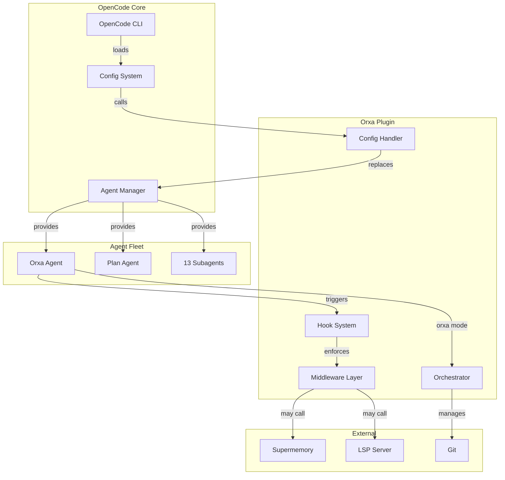

### Component Responsibilities

| Component          | Responsibility                              | Key Files               |
| -----------        | ---------------                             | -----------             |
| **Config Handler** | Intercepts OpenCode config, replaces agents | `src/config-handler.ts` |
| **Hook System**    | Lifecycle interception and enforcement      | `src/hooks/*.ts`        |
| **Middleware**     | Core enforcement logic                      | `src/middleware/*.ts`   |
| **Orchestrator**   | Parallel execution management               | `src/orxa/*.ts`         |
| **Commands**       | Slash command framework                     | `src/commands/*.ts`     |

---

## Plugin Lifecycle

### Initialization Flow

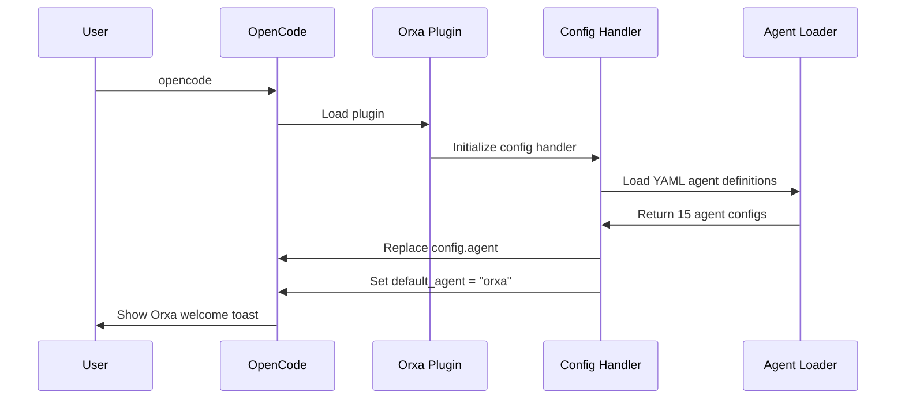

### Runtime Flow

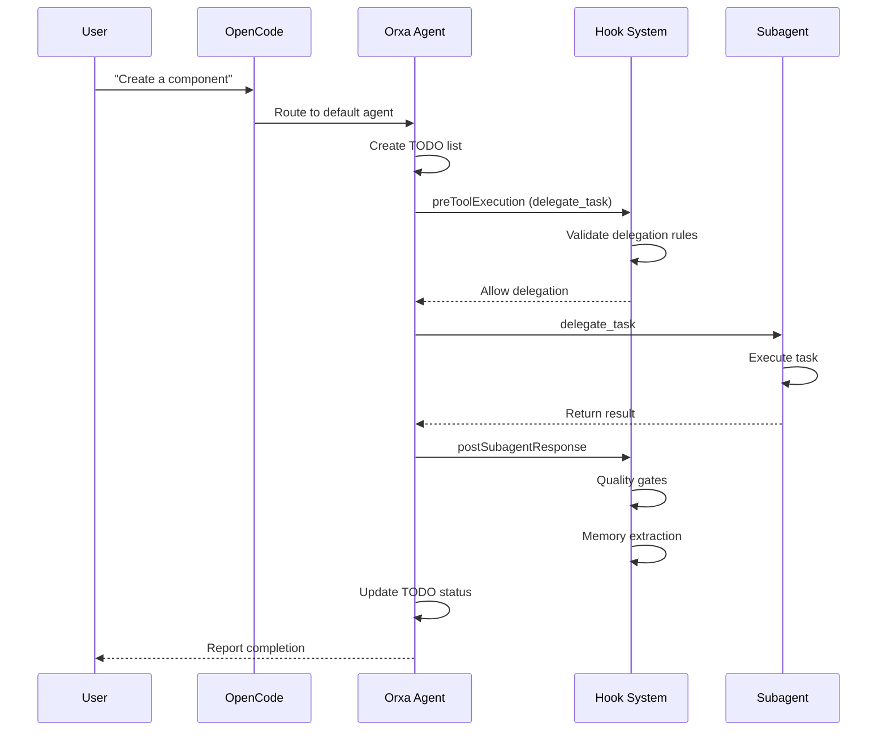

---

## Config Handler

### Purpose

The config handler is the **entry point** for Orxa's agent interception. It completely replaces OpenCode's default agent configuration with the Orxa agent fleet.

### How It Works

```typescript
// src/config-handler.ts
export const createConfigHandler = () => {
  return async (config: Record<string, unknown>): Promise<void> => {
    // Load all Orxa agents from YAML files
    const orxaAgents = loadOrxaAgents();
    
    // REPLACE config.agent entirely
    // This ignores user's opencode.json agent array
    config.agent = orxaAgents;
    
    // Set Orxa as default
    config.default_agent = "orxa";
  };
};
```

### Agent Loading Priority

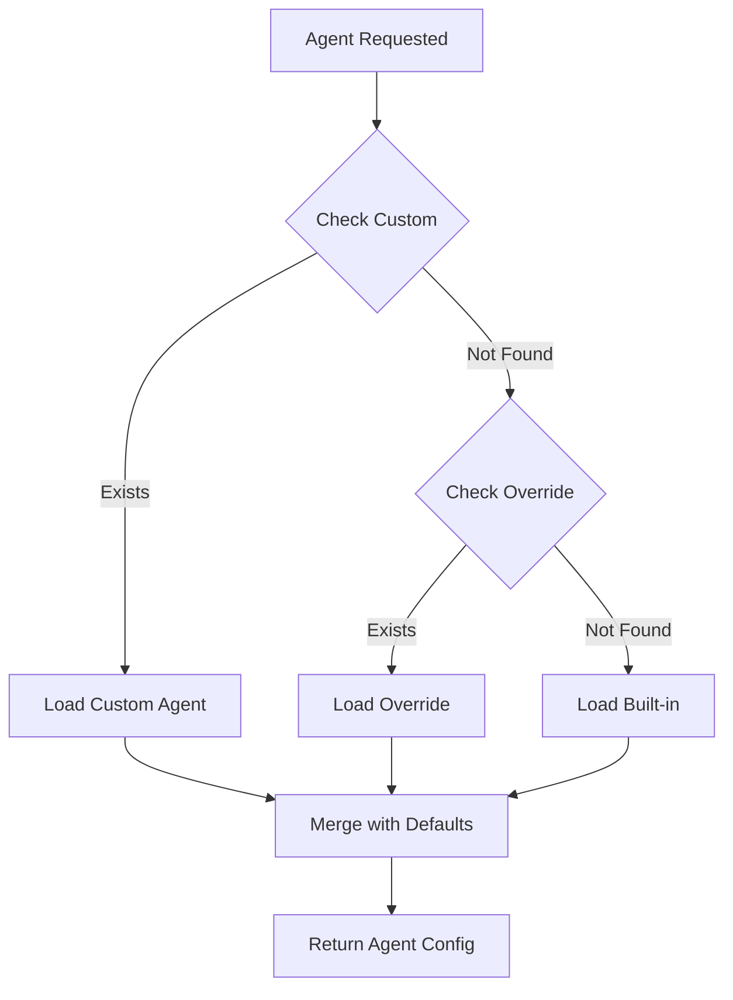

**Priority Order:**
1. **Custom agents** (`~/.config/opencode/orxa/agents/custom/`)
2. **Overrides** (`~/.config/opencode/orxa/agents/overrides/`)
3. **Built-in** (`agents/` in plugin directory)

### Agent Resolution

```typescript
// src/index.ts
export const resolveAgentDefinition = (
  agentName: string
): ResolvedAgentDefinition | null => {
  // 1. Check custom directory
  const customPath = findAgentFile(getCustomAgentsDir(), agentName);
  if (customPath) {
    return { name: agentName, path: customPath, source: "custom" };
  }

  // 2. Check overrides directory
  const overridePath = findAgentFile(getOverridesAgentsDir(), agentName);
  if (overridePath) {
    return { name: agentName, path: overridePath, source: "override" };
  }

  // 3. Check built-in directory
  const builtinPath = findAgentFile(BUILTIN_AGENTS_DIR, agentName);
  if (builtinPath) {
    return { name: agentName, path: builtinPath, source: "builtin" };
  }

  return null;
};
```

---

## Hook System

### Available Hooks

| Hook                       | When Triggered           | Purpose                             |
| ------                     | ---------------          | ---------                           |
| `preToolExecution`         | Before any tool runs     | Enforce delegation, check TODOs     |
| `postSubagentResponse`     | After subagent responds  | Quality gates, memory extraction    |
| `preTodoCompletion`        | Before marking TODO done | Validate completion criteria        |
| `sessionCheckpoint`        | Periodic during session  | Save session state                  |
| `todoContinuationEnforcer` | When Orxa tries to stop  | Prevent stopping with pending TODOs |
| `sessionCreated`           | New session started      | Show welcome toast                  |
| `orxaDetector`             | User sends message       | Detect `/orchestrate` command         |
| `orxaIndicator`            | Orxa mode active         | Show progress UI                    |

### Hook Execution Flow

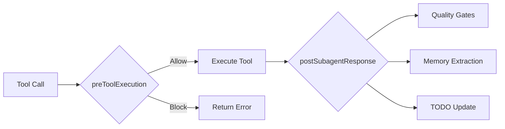

### Hook Context

All hooks receive a `HookContext` object:

```typescript
interface HookContext {
  tool?: {
    name: string;
    args: unknown;
  };
  toolName?: string;
  args: unknown;
  agent?: string;
  agentName?: string;
  config: OrxaConfig;
  session?: Session;
}
```

---

## Enforcement Mechanisms

### Delegation Enforcement

**Rule:** Only Orxa can use `delegate_task`

```typescript
// src/middleware/delegation-enforcer.ts
export const enforceDelegation = (context: HookContext): EnforcementResult => {
  const { toolName, agentName, config } = context;
  
  // Check if this is a delegation attempt
  if (toolName === "delegate_task" || toolName === "task") {
    // Only Orxa can delegate
    if (agentName !== "orxa" && config.governance.onlyOrxaCanDelegate) {
      return {
        allow: false,
        reason: "Only @orxa can delegate tasks. Request @orxa to delegate for you.",
        block: true,
      };
    }
  }
  
  return { allow: true };
};
```

### Tool Restriction Enforcement

**Rule:** Orxa has limited tool access (no grep/glob/bash/skill)

```typescript
const blockedTools = config.orxa.blockedTools; // ["grep", "glob", "bash", "skill"]

if (blockedTools.includes(toolName) && agentName === "orxa") {
  return {
    allow: false,
    reason: `Orxa cannot use ${toolName}. Delegate to appropriate subagent.`,
    suggestion: getDelegationSuggestion(toolName),
    block: true,
  };
}
```

### Memory Authority Enforcement

**Rule:** Only Orxa can write to supermemory

```typescript
if (toolName === "supermemory" && 
    context.args?.mode === "add" && 
    agentName !== "orxa") {
  return {
    allow: false,
    reason: "Only @orxa can write to memory. Provide Memory Recommendations instead.",
    block: true,
  };
}
```

### TODO Completion Enforcement

**Rule:** Orxa cannot stop with pending TODOs

```typescript
// src/hooks/todo-continuation-enforcer.ts
export const todoContinuationEnforcer = async (context: HookContext) => {
  const pendingTodos = getPendingTodos(context.session);
  
  if (pendingTodos.length > 0 && isStoppingResponse(context.args)) {
    return {
      allow: false,
      reason: `Cannot stop with ${pendingTodos.length} pending TODOs`,
      message: buildContinuationMessage(pendingTodos),
      block: true,
    };
  }
};
```

---

## Delegation Flow

### Standard Delegation Process

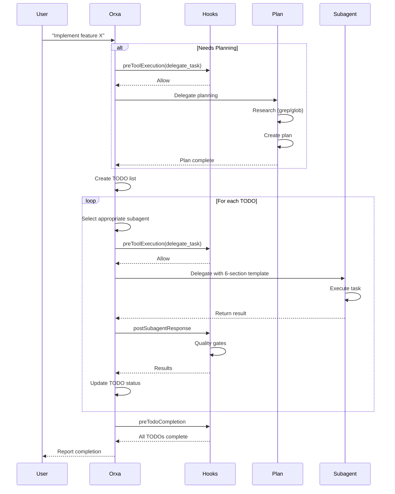

### The 6-Section Template

Every delegation includes:

```markdown
## Task
Clear description of what needs to be done

## Expected Outcome
Definition of success

## Required Tools
Explicit list of tools to use

## Must Do
Critical requirements (cannot be skipped)

## Must Not Do
Explicit restrictions

## Context
Background information and relevant files
```

---

## Quality Gates

### Gate Execution Flow

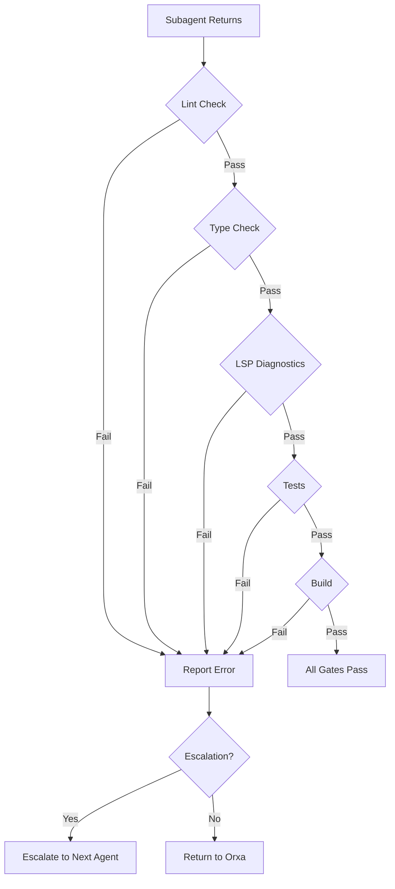

### Gate Implementation

```typescript
// src/middleware/quality-gates.ts
export const runQualityGates = async (
  files: string[],
  config: QualityGateSettings
): Promise<QualityGateResult> => {
  const results: GateResult[] = [];
  
  if (config.requireLint) {
    results.push(await runLintGate(files));
  }
  
  if (config.requireTypeCheck) {
    results.push(await runTypeCheckGate(files));
  }
  
  if (config.requireLspDiagnostics) {
    results.push(await runLspGate(files));
  }
  
  if (config.requireTests) {
    results.push(await runTestGate(files));
  }
  
  if (config.requireBuild) {
    results.push(await runBuildGate());
  }
  
  // Run custom validators
  for (const validator of config.customValidators) {
    results.push(await runCustomValidator(validator));
  }
  
  return {
    passed: results.every(r => r.passed),
    results,
  };
};
```

### LSP Integration

```typescript
// LSP diagnostics are checked via tool call
const lspResult = await lspDiagnostics({
  files: changedFiles,
  failOnError: config.qualityGates.requireLspDiagnostics,
});

if (lspResult.errors > 0) {
  return {
    passed: false,
    errors: lspResult.diagnostics,
  };
}
```

---

## Memory Automation

### Memory Extraction Flow

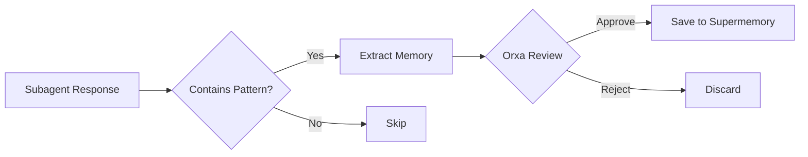

### Extraction Patterns

```typescript
// src/config/default-config.ts
memory: {
  autoExtract: true,
  extractPatterns: [
    "bug.*fix",      // "Fixed bug where..."
    "solution.*",    // "Solution: ..."
    "decided.*",     // "We decided to..."
    "pattern.*",     // "Pattern: ..."
    "config.*",      // "Configuration: ..."
  ],
  requiredTypes: [
    "error-solution",
    "learned-pattern",
    "project-config",
    "architecture",
  ],
}
```

### Memory Protocol

**Subagents:**
- Cannot use `supermemory add` directly
- Provide "Memory Recommendations" in responses
- Orxa reviews and saves

**Orxa:**
- Only agent that can write to supermemory
- Reviews subagent recommendations
- Proactively saves important patterns

---

## Orxa Orchestration Mode

### Overview

Orxa Orchestration Mode enables **parallel multi-agent execution** using git worktrees. Complex tasks are decomposed into independent workstreams that execute simultaneously.

### Architecture

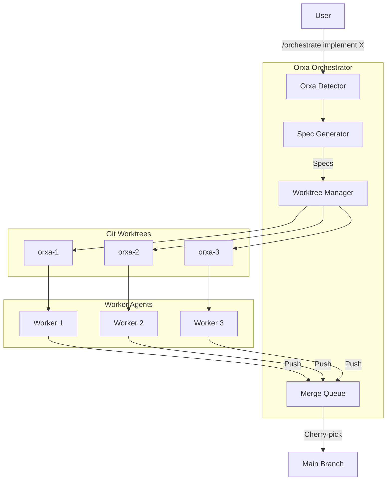

### Components

#### 1. Orxa Detector

Detects `/orchestrate` command in user messages:

```typescript
// src/hooks/orxa-detector.ts
export const orxaDetector = async (context: HookContext) => {
  const message = context.args?.message || "";
  
  if (message.match(/\b\/orchestrate\b/i)) {
    return {
      allow: true,
      orxaMode: true,
      cleanedMessage: message.replace(/\b\/orchestrate\b/gi, "").trim(),
    };
  }
};
```

#### 2. Spec Generator

Decomposes tasks into workstream specifications:

```typescript
// src/orxa/spec-generator.ts
export interface WorkstreamSpec {
  id: string;
  name: string;
  description: string;
  dependencies: string[];
  acceptance_criteria: string[];
  estimated_complexity: 'low' | 'medium' | 'high';
  recommended_agent: string;
}

export const generateSpecs = async (
  userRequest: string
): Promise<WorkstreamSpec[]> => {
  // Delegate to strategist to decompose task
  const specs = await delegateTask("strategist", `
    Decompose this request into parallel workstreams:
    ${userRequest}
    
    Return JSON array of workstream specs with dependencies.
  `);
  
  return JSON.parse(specs);
};
```

#### 3. Worktree Manager

Manages git worktrees for parallel execution:

```typescript
// src/orxa/worktree-manager.ts
export class WorktreeManager {
  async createWorktree(
    name: string,
    baseBranch: string
  ): Promise<WorktreeResult> {
    // Create worktree: git worktree add ../orxa-{name} -b orxa/{name}
    const worktreePath = path.join(this.baseDir, name);
    await exec(`git worktree add "${worktreePath}" -b orxa/${name}`);
    
    return {
      success: true,
      path: worktreePath,
      branch: `orxa/${name}`,
    };
  }
  
  async removeWorktree(name: string): Promise<void> {
    await exec(`git worktree remove "${name}"`);
  }
}
```

#### 4. Merge Queue

FIFO queue for completed workstreams:

```typescript
// src/orxa/merge-queue.ts
export class MergeQueue {
  async enqueue(item: OrxaQueueItem): Promise<void> {
    const queueFile = path.join(this.queueDir, `${item.id}.json`);
    await fs.writeFile(queueFile, JSON.stringify(item));
  }
  
  async dequeue(): Promise<OrxaQueueItem | null> {
    const files = await fs.readdir(this.queueDir);
    const oldest = files.sort()[0];
    if (!oldest) return null;
    
    const content = await fs.readFile(path.join(this.queueDir, oldest), 'utf-8');
    return JSON.parse(content);
  }
  
  async processQueue(): Promise<void> {
    while (true) {
      const item = await this.dequeue();
      if (!item) break;
      
      await this.cherryPickToMain(item);
    }
  }
}
```

---

## Worktree-Based Parallel Execution

### Execution Flow

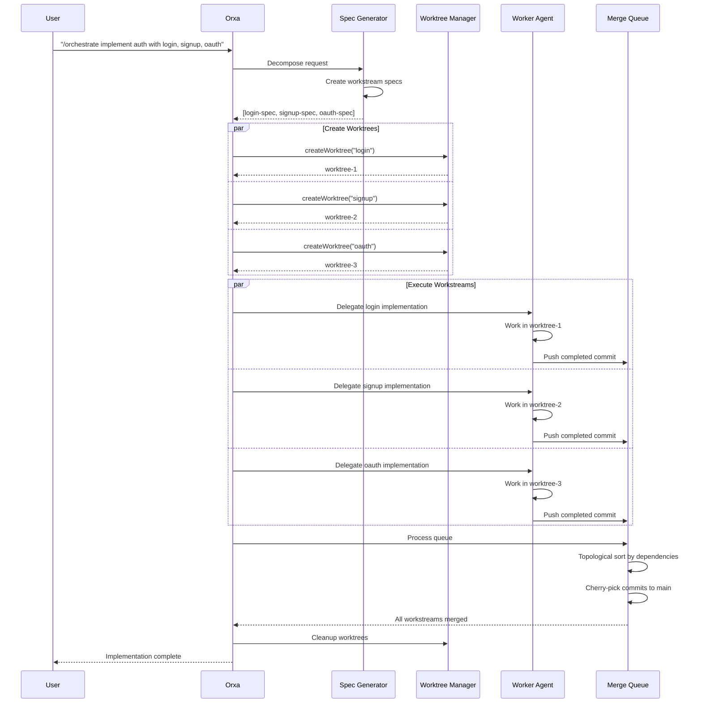

### Dependency Resolution

```typescript
// src/orxa/types.ts
export interface DependencyGraph {
  dependencies: Map<string, Set<string>>;
  dependents: Map<string, Set<string>>;
  roots: string[];
  topological_order: string[];
}

export const buildDependencyGraph = (
  workstreams: WorkstreamSpec[]
): DependencyGraph => {
  const graph: DependencyGraph = {
    dependencies: new Map(),
    dependents: new Map(),
    roots: [],
    topological_order: [],
  };
  
  // Build adjacency lists
  for (const ws of workstreams) {
    graph.dependencies.set(ws.id, new Set(ws.dependencies));
    
    for (const dep of ws.dependencies) {
      if (!graph.dependents.has(dep)) {
        graph.dependents.set(dep, new Set());
      }
      graph.dependents.get(dep)!.add(ws.id);
    }
  }
  
  // Find roots (no dependencies)
  graph.roots = workstreams
    .filter(ws => ws.dependencies.length === 0)
    .map(ws => ws.id);
  
  // Topological sort
  graph.topological_order = topologicalSort(graph);
  
  return graph;
};
```

---

## Merge Queue System

### Queue State Machine

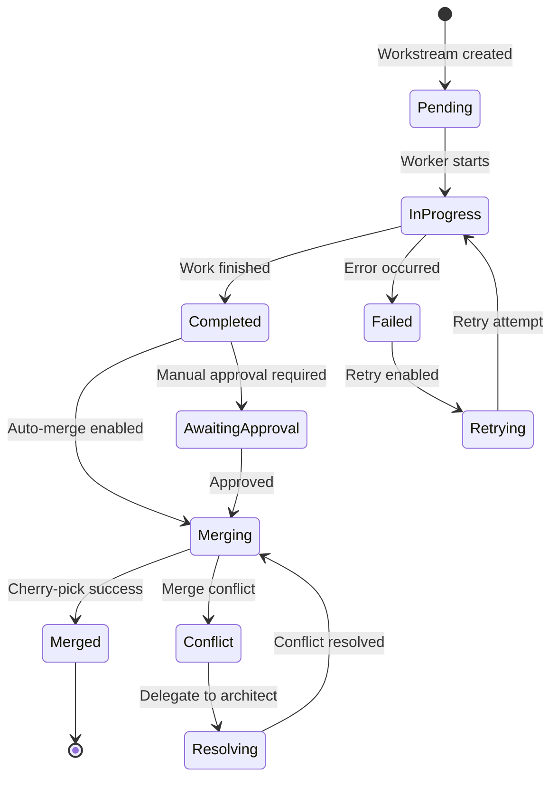

### Conflict Resolution

```typescript
// src/orxa/merge-queue.ts
export const resolveConflicts = async (
  item: OrxaQueueItem,
  config: OrxaConfig
): Promise<ConflictResolutionResult> => {
  // Try auto-resolution first
  const autoResult = await tryAutoResolve(item);
  if (autoResult.resolved) {
    return autoResult;
  }
  
  // Delegate to conflict resolution agent
  const agent = config.orchestration.conflict_resolution_agent;
  const resolution = await delegateTask(agent, `
    Resolve merge conflicts for workstream ${item.workstream_id}.
    
    Conflicting files: ${item.conflict_files?.join(", ")}
    
    Analyze both versions and create a resolved version that
    incorporates changes from both branches correctly.
  `);
  
  return {
    resolved: true,
    method: "delegated",
    resolved_files: item.conflict_files || [],
  };
};
```

---

## Data Flow Diagrams

### Configuration Loading

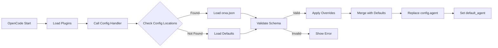

### Tool Execution Interception

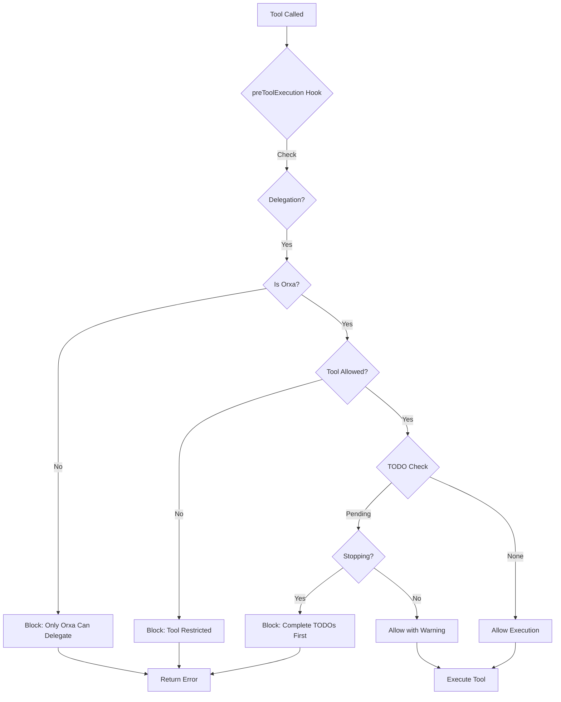

### Session Checkpoint Flow

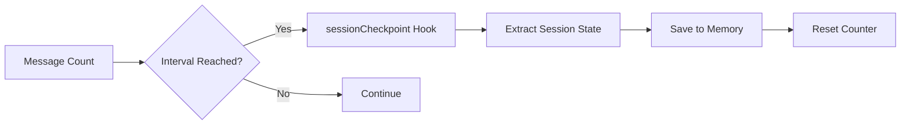

---

## Extension Points

### Adding Custom Hooks

```typescript
// src/hooks/my-custom-hook.ts
import { HookContext, EnforcementResult } from '../types';

export const myCustomHook = async (
  context: HookContext
): Promise<EnforcementResult> => {
  // Your custom logic here
  if (shouldBlock(context)) {
    return {
      allow: false,
      reason: "Custom enforcement rule violated",
      block: true,
    };
  }
  
  return { allow: true };
};
```

Register in `src/index.ts`:

```typescript
export const orxaPlugin: OrxaPlugin = {
  // ...
  hooks: {
    // ... existing hooks
    myCustomHook,
  },
};
```

### Adding Custom Middleware

```typescript
// src/middleware/my-middleware.ts
export const myMiddleware = {
  enforce: (context: HookContext) => {
    // Enforcement logic
  },
  validate: (result: unknown) => {
    // Validation logic
  },
};
```

### Adding Custom Quality Gates

```typescript
// Custom validator in config
{
  "qualityGates": {
    "customValidators": [
      {
        "name": "Security Scan",
        "command": "npm run security:scan",
        "required": true
      }
    ]
  }
}
```

---

## Related Documentation

- [CONFIGURATION.md](CONFIGURATION.md) — Configuration options
- [AGENTS.md](AGENTS.md) — Agent system details
- [ORXA-MODE.md](ORXA-MODE.md) — Orchestration mode guide
- [FEATURES.md](FEATURES.md) — All capabilities
