# Features Reference

Complete guide to all capabilities and features of the OpenCode Orxa plugin.

## Table of Contents

- [Feature Overview](#feature-overview)
- [Core Features](#core-features)
  - [Slash Commands](#slash-commands)
  - [Hooks & Lifecycle Automation](#hooks--lifecycle-automation)
  - [Quality Gates](#quality-gates)
  - [Memory Automation](#memory-automation)
- [Enforcement Features](#enforcement-features)
  - [Delegation Enforcement](#delegation-enforcement)
  - [TODO Completion Guardian](#todo-completion-guardian)
  - [Tool Restrictions](#tool-restrictions)
- [Developer Experience](#developer-experience)
  - [Comment Checker](#comment-checker)
  - [AGENTS.md Injection](#agentsmd-injection)
  - [Welcome Toast](#welcome-toast)
- [Advanced Features](#advanced-features)
  - [Orxa Orchestration Mode](#orxa-orchestration-mode)
  - [Background Task Support](#background-task-support)
  - [Escalation Matrix](#escalation-matrix)
- [Configuration Features](#configuration-features)
- [Feature Comparison](#feature-comparison)

---

## Feature Overview

Orxa provides **40+ features** across 6 categories:

| Category                 | Features                                       | Purpose                 |
| ----------               | ----------                                     | ---------               |
| **Core**                 | Slash commands, hooks, quality gates, memory   | Essential functionality |
| **Enforcement**          | Delegation, TODO completion, tool restrictions | Pattern adherence       |
| **Developer Experience** | Comment checker, AGENTS.md injection, toasts   | Workflow enhancement    |
| **Advanced**             | Orxa mode, background tasks, escalation        | Power user tools        |
| **Configuration**        | YAML overrides, custom agents, CLI             | Customization           |

---

## Core Features

### Slash Commands

9 built-in slash commands for common workflows:

| Command     | Aliases        | Agents Used                          | Purpose                  |
| ---------   | ---------      | -------------                        | ---------                |
| `/validate` | `/v`, `/check` | strategist, reviewer                 | Pre-execution validation |
| `/refactor` | `/rf`          | architect, explorer, build, reviewer | Intelligent refactoring  |
| `/explain`  | `/ex`, `/exp`  | librarian                            | Educational explanations |
| `/test`     | `/t`           | build, reviewer                      | Test generation          |
| `/debug`    | `/dbg`, `/fix` | architect, explorer, coder           | Systematic debugging     |
| `/commit`   | `/c`, `/git`   | git                                  | Smart git commits        |
| `/docs`     | —              | writer                               | Documentation generation |
| `/search`   | `/s`, `/find`  | explorer, navigator                  | Codebase + web search    |
| `/review`   | —              | reviewer                             | Code review              |

**Detailed Documentation:** [SLASH-COMMANDS.md](SLASH-COMMANDS.md)

**Usage Example:**
```
You: /refactor src/components/Button.tsx

Orxa: ## 🔧 Refactoring: src/components/Button.tsx

Starting intelligent refactoring workflow...

**Actions:**
1. @architect: Analyze current architecture
2. @explorer: Find all references
3. @build: Execute refactoring
4. Run quality gates
5. @reviewer: Review changes
```

---

### Hooks & Lifecycle Automation

8 lifecycle hooks provide interception points:

| Hook                       | When                        | Purpose                 |
| ------                     | ------                      | ---------               |
| `preToolExecution`         | Before tool runs            | Enforce rules, validate |
| `postSubagentResponse`     | After subagent returns      | Quality gates, memory   |
| `preTodoCompletion`        | Before TODO marked done     | Validate completion     |
| `sessionCheckpoint`        | Periodic (every N messages) | Save session state      |
| `todoContinuationEnforcer` | When Orxa tries to stop     | Prevent incomplete work |
| `sessionCreated`           | New session starts          | Welcome toast           |
| `orxaDetector`             | User sends message          | Detect "orxa" keyword   |
| `orxaIndicator`            | Orxa mode active            | Progress UI             |

**Hook Execution Order:**

```
User Request
    │
    ▼
[orxaDetector] ──► Detect "orxa" keyword
    │
    ▼
[preToolExecution] ──► Check delegation, tools, TODOs
    │
    ▼
Execute Tool / Delegate
    │
    ▼
[postSubagentResponse] ──► Quality gates, memory extraction
    │
    ▼
[preTodoCompletion] ──► Validate completion
    │
    ▼
[sessionCheckpoint] ──► Save state (periodic)
```

**Technical Documentation:** [ARCHITECTURE.md](ARCHITECTURE.md#hook-system)

---

### Quality Gates

Automated quality verification before work is considered complete.

#### Built-in Gates

| Gate                | Tool                      | Description               |
| ------              | ------                    | -------------             |
| **Lint**            | `npm run lint` / `eslint` | Code style compliance     |
| **Type Check**      | `tsc --noEmit`            | TypeScript type safety    |
| **LSP Diagnostics** | LSP server                | Real-time error detection |
| **Tests**           | `npm test` / `jest`       | Test suite pass           |
| **Build**           | `npm run build`           | Production build success  |

#### Gate Execution Flow

```mermaid
graph TD
    A[Subagent Completes] --> B{Lint Pass?}
    B -->|No| C[Report Error]
    B -->|Yes| D{Type Check Pass?}
    D -->|No| C
    D -->|Yes| E{LSP Clean?}
    E -->|No| C
    E -->|Yes| F{Tests Pass?}
    F -->|No| C
    F -->|Yes| G{Build Success?}
    G -->|No| C
    G -->|Yes| H[All Gates Pass ✓]
    
    C --> I{Escalate?}
    I -->|Yes| J[Delegate to Next Agent]
    I -->|No| K[Return to Orxa]
```



#### Custom Validators

Add project-specific gates:

```json
{
  "qualityGates": {
    "customValidators": [
      {
        "name": "Security Scan",
        "command": "npm run security:scan",
        "required": true
      },
      {
        "name": "API Contract Check",
        "command": "npm run test:contracts",
        "required": false
      }
    ]
  }
}
```

**Configuration:** See [CONFIGURATION.md](CONFIGURATION.md#quality-gates)

---

### Memory Automation

Intelligent extraction and management of project knowledge.

#### How It Works


#### Extraction Patterns

```json
{
  "memory": {
    "autoExtract": true,
    "extractPatterns": [
      "bug.*fix",
      "solution.*",
      "decided.*",
      "pattern.*",
      "config.*"
    ]
  }
}
```

#### Memory Types

| Type              | Description      | Example                                |
| ------            | -------------    | ---------                              |
| `error-solution`  | Bug fixes        | "Fixed TypeError by adding null check" |
| `learned-pattern` | Coding patterns  | "Use zod for all validation"           |
| `project-config`  | Configuration    | "API base URL is /api/v1"              |
| `architecture`    | Design decisions | "Use repository pattern"               |
| `preference`      | User preferences | "Prefer async/await"                   |

#### Memory Protocol

**Subagents:**
- ❌ Cannot use `supermemory add` directly
- ✅ Provide "Memory Recommendations" in responses
- ✅ Orxa reviews and decides to save

**Orxa:**
- ✅ Only agent that can write to supermemory
- ✅ Reviews subagent recommendations
- ✅ Proactively saves important patterns

**Example Memory Recommendation:**
```markdown
## Implementation Complete

[Work description...]

**Memory Recommendation:**
- Type: learned-pattern
- Content: "When using React Query, always include error boundaries 
  at the route level to catch query errors"
- Tags: react, react-query, error-handling
```

---

## Enforcement Features

### Delegation Enforcement

**Rule:** Only Orxa can use `delegate_task`

**Why:**
- Centralized orchestration
- Consistent delegation patterns
- Proper context passing
- Quality verification

**Enforcement Levels:**

| Level    | Behavior                 |
| -------  | ----------               |
| `strict` | Block with error message |
| `warn`   | Allow with warning       |
| `off`    | No enforcement           |

**Error Message:**
```
❌ Delegation Blocked

Only @orxa can delegate tasks. 

Request @orxa to delegate this task for you with proper context.
```

---

### TODO Completion Guardian

**Rule:** Orxa cannot stop or ask "what next?" with pending TODOs

**The Problem:**
Without enforcement:
1. Orxa creates TODO list
2. Orxa delegates first task
3. Subagent completes work
4. Orxa says "What's next?" or stops
5. User has to manually track remaining TODOs

**The Solution:**
```typescript
// src/hooks/todo-continuation-enforcer.ts
if (pendingTodos.length > 0 && isStoppingResponse(message)) {
  return {
    allow: false,
    reason: "Cannot stop with pending TODOs",
    message: `You have ${pendingTodos.length} pending TODOs:
    ${pendingTodos.map(t => `- ${t.text}`).join('\n')}
    
    Please complete or update these TODOs before stopping.`,
  };
}
```

**Enforcement Levels:**

| Level    | Behavior                                |
| -------  | ----------                              |
| `strict` | Block stopping, require TODO completion |
| `warn`   | Warn but allow stopping                 |
| `off`    | No enforcement                          |

---

### Tool Restrictions

**Rule:** Orxa has limited tool access (no grep/glob/bash/skill)

**Allowed Tools:**
| Tool                   | Purpose                |
| ------                 | ---------              |
| `read`                 | Read files             |
| `delegate_task`        | Delegate to subagents  |
| `todowrite`/`todoread` | Manage TODOs           |
| `supermemory`          | Access memory          |
| `edit`/`write`         | Modify plan files only |

**Blocked Tools:**
| Tool            | Delegate To          |
| ------          | -------------        |
| `grep`          | `@plan`              |
| `glob`          | `@plan`              |
| `bash`          | Appropriate subagent |
| `skill`         | Appropriate subagent |
| `ios-simulator` | `@mobile-simulator`  |

**Why These Restrictions?**
- Forces proper delegation
- Keeps Orxa focused on orchestration
- Ensures specialized agents handle specialized tools
- Prevents "do everything" anti-pattern

---

## Developer Experience

### Comment Checker

**Purpose:** Warn on excessive commenting that may indicate LLM-generated code.

**How It Works:**
```typescript
// src/hooks/comment-checker.ts
const commentRatio = commentChars / totalChars;

if (commentRatio > 0.5) {
  return {
    warn: true,
    message: "⚠️ Comment ratio exceeds 50% — possible LLM over-commenting",
  };
} else if (commentRatio > 0.3) {
  return {
    warn: true,
    message: "⚠️ Comment ratio exceeds 30% — consider reducing comments",
  };
}
```

**Thresholds:**
- > 50% comments → Error
- > 30% comments → Warning

---

### AGENTS.md Injection

**Purpose:** Automatically inject relevant AGENTS.md context when reading code.

**How It Works:**
1. When agent reads a file, hook intercepts
2. Walks up directory tree looking for AGENTS.md
3. Injects relevant sections into context
4. Agent has immediate access to architectural context

**Example:**
```typescript
// src/hooks/agents-md-injector.ts
export const agentsMdInjector = async (context: HookContext) => {
  const filePath = context.args?.filePath;
  const agentsMdPath = findAgentsMd(filePath);
  
  if (agentsMdPath) {
    const relevantSection = extractRelevantSection(agentsMdPath, filePath);
    context.injectedContext = relevantSection;
  }
};
```

**Benefits:**
- Agents understand project conventions
- Consistent patterns across codebase
- Reduced need for repetitive context

---

### Welcome Toast

**Purpose:** Confirm Orxa plugin is active on session start.

**Appearance:**
```
🎼 OpenCode Orxa
15 agents loaded • Strict mode
```

**Information Shown:**
- Plugin name and version
- Number of agents loaded
- Enforcement mode (strict/warn/off)
- Quick help hint

---

## Advanced Features

### Orxa Orchestration Mode

**Purpose:** Parallel multi-agent execution using git worktrees.

**Key Capabilities:**
- Up to 5 parallel workstreams
- Automatic dependency resolution
- Git worktree isolation
- FIFO merge queue
- Conflict resolution

**Usage:**
```
orxa implement authentication with login, signup, oauth
```

**Detailed Documentation:** [ORXA-MODE.md](ORXA-MODE.md)

---

### Background Task Support

**Purpose:** Continue work while waiting for long-running operations.

**How It Works:**
1. Orxa delegates task to subagent
2. Subagent works in background
3. Orxa continues with other tasks
4. Notification when subagent completes

**Configuration:**
```json
{
  "subagents": {
    "defaults": {
      "timeout": 300000  // 5 minutes
    }
  }
}
```

---

### Escalation Matrix

**Purpose:** Automatically escalate failed tasks to more capable agents.

**Default Matrix:**
```
coder → build → architect
explorer → librarian
```

**How It Works:**
1. Agent fails quality gates
2. Check if max attempts reached
3. Look up escalation target
4. Delegate to next agent with context
5. Track escalation chain

**Configuration:**
```json
{
  "escalation": {
    "enabled": true,
    "maxAttemptsPerAgent": 2,
    "escalationMatrix": {
      "coder": "build",
      "build": "architect",
      "frontend": "build"
    }
  }
}
```

---

## Configuration Features

### Agent Overrides

Customize agents without modifying YAML files:

**Primary Agents (model only):**
```json
{
  "agent_overrides": {
    "orxa": {
      "model": "opencode/gpt-5.2-codex"
    }
  }
}
```

**Subagents (full customization):**
```json
{
  "agent_overrides": {
    "build": {
      "model": "opencode/gpt-5.2-codex",
      "temperature": 0.2,
      "customInstructions": "Always run tests after changes"
    }
  }
}
```

### Custom Agents

Create entirely new agents:

```yaml
# ~/.config/opencode/orxa/agents/custom/database-expert.yaml
name: database-expert
description: Database specialist
mode: subagent
model: opencode/gpt-5.2-codex
system_prompt: |
  You are a database expert...
tools:
  - read
  - edit
  - bash
```

### CLI Commands

| Command        | Purpose                  |
| ---------      | ---------                |
| `orxa init`    | Interactive setup wizard |
| `orxa install` | Enable/disable agents    |
| `orxa doctor`  | Validate configuration   |
| `orxa config`  | Open config in editor    |

---

## Feature Comparison

### Orxa vs Default OpenCode

| Feature            | OpenCode          | Orxa            |
| ---------          | ----------        | ------          |
| Agent System       | Single generalist | 15 specialists  |
| Delegation         | Any agent         | Orxa only       |
| Quality Gates      | Manual            | Automated       |
| Memory             | Manual            | Automated       |
| TODO Tracking      | Basic             | Enforced        |
| Parallel Execution | No                | Yes (Orxa mode) |
| Tool Restrictions  | No                | Yes             |
| Slash Commands     | Basic             | 9 advanced      |

### Orxa vs oh-my-opencode

| Feature                | oh-my-opencode  | Orxa            |
| ---------              | --------------- | ------          |
| Primary Pattern        | Momus/Reviewer  | Orxa/Manager    |
| Agent Count            | 15+             | 15              |
| Orchestration          | No              | Yes (Orxa mode) |
| Worktrees              | No              | Yes             |
| Parallel Execution     | No              | Yes             |
| Merge Queue            | No              | Yes             |
| Delegation Enforcement | Yes             | Yes             |
| TODO Enforcement       | No              | Yes             |

---

## Feature Roadmap

### Current (v1.0)
- ✅ All core features
- ✅ 9 slash commands
- ✅ Orxa orchestration mode
- ✅ Full enforcement suite

### Planned (v1.1)
- 🔄 Additional slash commands
- 🔄 Enhanced conflict resolution
- 🔄 Workstream templates

### Future (v2.0)
- 📋 Multi-repo orchestration
- 📋 Advanced scheduling
- 📋 Metrics and analytics

---

## Related Documentation

- [CONFIGURATION.md](CONFIGURATION.md) — Configure all features
- [AGENTS.md](AGENTS.md) — Agent system details
- [ARCHITECTURE.md](ARCHITECTURE.md) — How features work
- [ORXA-MODE.md](ORXA-MODE.md) — Orchestration details
- [SLASH-COMMANDS.md](SLASH-COMMANDS.md) — Command reference
