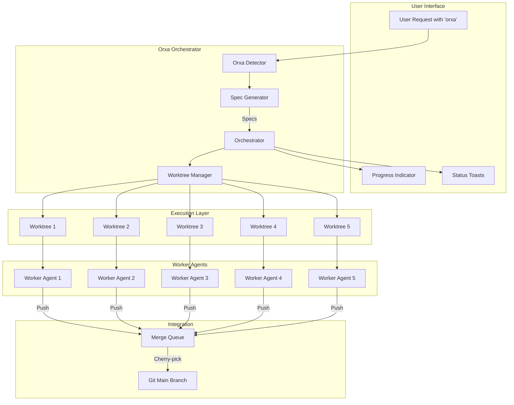
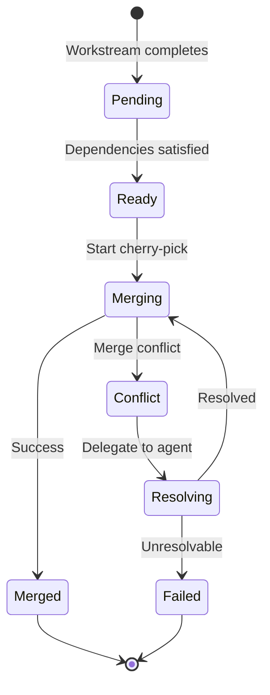

# Orxa Orchestration Mode

Complete guide to Orxa's parallel multi-agent execution system — achieve 3-5x faster development through intelligent work decomposition and parallel execution.

## Table of Contents

- [What is Orxa Mode?](#what-is-orxa-mode)
- [When to Use Orxa Mode](#when-to-use-orxa-mode)
- [Architecture Overview](#architecture-overview)
- [How It Works](#how-it-works)
- [Usage Examples](#usage-examples)
- [Configuration Options](#configuration-options)
- [Workstream Specifications](#workstream-specifications)
- [Dependency Management](#dependency-management)
- [Merge Queue](#merge-queue)
- [Best Practices](#best-practices)
- [Troubleshooting](#troubleshooting)
- [Comparison with Normal Delegation](#comparison-with-normal-delegation)

---

## What is Orxa Mode?

Orxa Orchestration Mode is a **parallel execution system** that breaks complex tasks into independent workstreams and executes them simultaneously using git worktrees.

### Key Capabilities

| Feature                   | Benefit                                          |
| ---------                 | ---------                                        |
| **Parallel Execution**    | Up to 5 workstreams run simultaneously           |
| **Dependency Resolution** | Automatic topological sorting of dependent tasks |
| **Git Worktrees**         | Isolated workspaces prevent conflicts            |
| **Automatic Merging**     | FIFO queue with cherry-pick integration          |
| **Conflict Resolution**   | Delegated to architect agent                     |
| **Progress Tracking**     | Real-time UI indicators                          |

### The "Orxa" Keyword

Activate Orxa mode by including "orxa" in your request:

```
orxa implement authentication with login, signup, and oauth
orxa create REST API for users, posts, and comments  
orxa build dashboard with sidebar, charts, and tables
```

---

## When to Use Orxa Mode

### ✅ Ideal Use Cases

| Scenario                         | Why Orxa Mode Helps                        |
| ----------                       | ---------------------                      |
| **Multi-feature implementation** | Login + Signup + OAuth can be parallelized |
| **API endpoint creation**        | Independent endpoints work in parallel     |
| **UI component library**         | Components can be built simultaneously     |
| **Refactoring across modules**   | Different modules = parallel workstreams   |
| **Test suite expansion**         | Independent tests run in parallel          |

### ❌ Not Recommended For

| Scenario                  | Why Not Use Orxa Mode                  |
| ----------                | ----------------------                 |
| **Single focused task**   | Overhead not worth it for simple work  |
| **Highly dependent work** | If everything depends on everything    |
| **Exploratory work**      | Unknown scope makes decomposition hard |
| **Urgent hotfixes**       | Sequential is faster for single issues |

### Decision Flowchart

```
Is the task complex with multiple independent parts?
├── NO → Use normal delegation
│
└── YES → Are there clear boundaries between parts?
          ├── NO → Use normal delegation
          │
          └── YES → Are there dependency chains?
                    ├── Simple/no deps → Use orxa mode
                    └── Complex deps → Use orxa mode with dependency mapping
```

---

## Architecture Overview

### System Components



### Component Responsibilities

| Component            | File                           | Purpose                             |
| -----------          | ------                         | ---------                           |
| **Orxa Detector**    | `src/hooks/orxa-detector.ts`   | Detects "orxa" keyword in messages  |
| **Orxa Indicator**   | `src/hooks/orxa-indicator.ts`  | Shows progress UI                   |
| **Spec Generator**   | `src/orxa/spec-generator.ts`   | Decomposes tasks into workstreams   |
| **Worktree Manager** | `src/orxa/worktree-manager.ts` | Manages git worktrees               |
| **Orchestrator**     | `src/orxa/orchestrator.ts`     | Coordinates parallel execution      |
| **Merge Queue**      | `src/orxa/merge-queue.ts`      | FIFO queue with conflict resolution |

---

## How It Works

### Phase 1: Detection

```typescript
// src/hooks/orxa-detector.ts
export const orxaDetector = async (context: HookContext) => {
  const message = context.args?.message || "";
  
  // Check for "orxa" keyword (case insensitive, word boundary)
  if (message.match(/\borxa\b/i)) {
    return {
      allow: true,
      orxaMode: true,
      cleanedMessage: message.replace(/\borxa\b/gi, "").trim(),
    };
  }
};
```

### Phase 2: Task Decomposition

The strategist agent breaks the request into workstream specifications:

```typescript
// src/orxa/spec-generator.ts
export const generateSpecs = async (userRequest: string) => {
  const prompt = `
Decompose this request into parallel workstreams:
"${userRequest}"

Return a JSON array of workstream specifications:
[
  {
    "id": "unique-id",
    "name": "Workstream Name",
    "description": "Detailed description",
    "dependencies": ["ids-of-prerequisites"],
    "acceptance_criteria": ["criteria-1", "criteria-2"],
    "estimated_complexity": "low|medium|high",
    "recommended_agent": "build|frontend|coder|etc"
  }
]
`;
  
  const response = await delegateTask("strategist", prompt);
  return JSON.parse(response);
};
```

### Phase 3: Worktree Creation

```typescript
// src/orxa/worktree-manager.ts
export class WorktreeManager {
  async createWorktrees(specs: WorkstreamSpec[]) {
    const worktrees: Worktree[] = [];
    
    for (const spec of specs) {
      const worktreeName = `${this.config.worktree_prefix}-${spec.id}`;
      const worktreePath = path.join(this.baseDir, worktreeName);
      
      // Create worktree: git worktree add ../orxa-login -b orxa/login
      await exec(`git worktree add "${worktreePath}" -b orxa/${spec.id}`);
      
      worktrees.push({
        name: worktreeName,
        path: worktreePath,
        branch: `orxa/${spec.id}`,
        spec,
      });
    }
    
    return worktrees;
  }
}
```

### Phase 4: Parallel Execution

```typescript
// src/orxa/orchestrator.ts
export class OrxaOrchestrator {
  async executeWorkstreams(worktrees: Worktree[]) {
    const queue = new PQueue({
      concurrency: this.config.max_parallel_workstreams,
    });
    
    const results = await Promise.all(
      worktrees.map(worktree =>
        queue.add(() => this.executeWorkstream(worktree))
      )
    );
    
    return results;
  }
  
  private async executeWorkstream(worktree: Worktree) {
    // Delegate to worker agent in worktree context
    const worker = await this.createWorkerAgent(worktree);
    
    const result = await worker.execute({
      spec: worktree.spec,
      worktreePath: worktree.path,
    });
    
    // Push to merge queue on completion
    if (result.success) {
      await this.mergeQueue.enqueue({
        workstream_id: worktree.spec.id,
        commit_hash: result.commit_hash,
      });
    }
    
    return result;
  }
}
```

### Phase 5: Merge Queue Processing

```typescript
// src/orxa/merge-queue.ts
export class MergeQueue {
  async processQueue() {
    while (true) {
      const item = await this.dequeue();
      if (!item) break;
      
      // Check dependencies
      if (!await this.dependenciesSatisfied(item)) {
        await this.requeue(item);
        continue;
      }
      
      // Attempt cherry-pick
      try {
        await this.cherryPickToMain(item.commit_hash);
        item.status = 'merged';
      } catch (error) {
        if (error.isConflict) {
          item.status = 'conflict';
          await this.resolveConflicts(item);
        } else {
          item.status = 'failed';
        }
      }
      
      await this.updateQueueFile(item);
    }
  }
}
```

---

## Usage Examples

### Example 1: Authentication System

**Request:**
```
orxa implement authentication with login, signup, and oauth
```

**Generated Workstreams:**

| ID          | Name                | Dependencies   | Agent       |
| ----        | ------              | -------------- | -------     |
| `auth-base` | Auth Infrastructure | None           | `architect` |
| `login`     | Login Feature       | `auth-base`    | `frontend`  |
| `signup`    | Signup Feature      | `auth-base`    | `frontend`  |
| `oauth`     | OAuth Integration   | `auth-base`    | `build`     |

**Execution:**
1. `auth-base` starts immediately (no deps)
2. Once `auth-base` completes, `login`, `signup`, and `oauth` run in parallel
3. All three merge to main in order of completion

### Example 2: REST API

**Request:**
```
orxa create REST API for users, posts, and comments
```

**Generated Workstreams:**

| ID             | Name               | Dependencies            | Agent       |
| ----           | ------             | --------------          | -------     |
| `api-base`     | API Infrastructure | None                    | `architect` |
| `users-api`    | Users Endpoints    | `api-base`              | `build`     |
| `posts-api`    | Posts Endpoints    | `api-base`              | `build`     |
| `comments-api` | Comments Endpoints | `api-base`, `posts-api` | `build`     |

**Note:** `comments-api` depends on `posts-api` because comments relate to posts.

### Example 3: Dashboard Components

**Request:**
```
orxa build dashboard with sidebar, charts, and tables
```

**Generated Workstreams:**

| ID                 | Name              | Dependencies       | Agent      |
| ----               | ------            | --------------     | -------    |
| `dashboard-layout` | Dashboard Layout  | None               | `frontend` |
| `sidebar`          | Sidebar Component | `dashboard-layout` | `frontend` |
| `charts`           | Chart Components  | `dashboard-layout` | `frontend` |
| `tables`           | Table Components  | `dashboard-layout` | `frontend` |

---

## Configuration Options

### Orchestration Settings

```json
{
  "orchestration": {
    "enabled": true,
    "max_parallel_workstreams": 5,
    "queue_directory": "~/.orxa-queue",
    "auto_merge": true,
    "conflict_resolution_agent": "architect",
    "worktree_prefix": "orxa",
    "cleanup_worktrees": true,
    "require_merge_approval": false,
    "workstream_timeout_minutes": 120,
    "retry_failed_workstreams": false,
    "max_retries": 2,
    "queue_poll_interval_ms": 5000
  }
}
```

### Option Reference

| Option                       | Type      | Default           | Description                |
| --------                     | ------    | ---------         | -------------              |
| `enabled`                    | `boolean` | `true`            | Enable orchestration mode  |
| `max_parallel_workstreams`   | `number`  | `5`               | Max concurrent workstreams |
| `queue_directory`            | `string`  | `"~/.orxa-queue"` | Queue storage location     |
| `auto_merge`                 | `boolean` | `true`            | Auto-merge completed work  |
| `conflict_resolution_agent`  | `string`  | `"architect"`     | Agent for conflicts        |
| `worktree_prefix`            | `string`  | `"orxa"`          | Worktree name prefix       |
| `cleanup_worktrees`          | `boolean` | `true`            | Remove worktrees after     |
| `require_merge_approval`     | `boolean` | `false`           | Manual approval required   |
| `workstream_timeout_minutes` | `number`  | `120`             | Timeout per workstream     |
| `retry_failed_workstreams`   | `boolean` | `false`           | Retry on failure           |
| `max_retries`                | `number`  | `2`               | Max retry attempts         |
| `queue_poll_interval_ms`     | `number`  | `5000`            | Queue poll frequency       |

### Performance Tuning

**For Fast Machines:**
```json
{
  "orchestration": {
    "max_parallel_workstreams": 8,
    "workstream_timeout_minutes": 60,
    "queue_poll_interval_ms": 2000
  }
}
```

**For Conservative Execution:**
```json
{
  "orchestration": {
    "max_parallel_workstreams": 3,
    "workstream_timeout_minutes": 180,
    "require_merge_approval": true,
    "auto_merge": false
  }
}
```

---

## Workstream Specifications

### Specification Format

```typescript
interface WorkstreamSpec {
  id: string;                    // Unique identifier
  name: string;                  // Human-readable name
  description: string;           // Detailed description
  dependencies: string[];        // IDs of prerequisite workstreams
  acceptance_criteria: string[]; // Completion criteria
  estimated_complexity: 'low' | 'medium' | 'high';
  context_files?: string[];      // Relevant files
  timeout_minutes?: number;      // Override timeout
  recommended_agent?: string;    // Best agent for this work
}
```

### Example Specification

```json
{
  "id": "login-feature",
  "name": "Login Feature Implementation",
  "description": "Implement user login with email/password including form validation, API integration, and error handling.",
  "dependencies": ["auth-infrastructure"],
  "acceptance_criteria": [
    "Login form validates email format",
    "Password must be at least 8 characters",
    "Successful login stores JWT token",
    "Failed login shows appropriate error",
    "Form has loading state during submission"
  ],
  "estimated_complexity": "medium",
  "context_files": [
    "src/types/auth.ts",
    "src/api/client.ts"
  ],
  "recommended_agent": "frontend"
}
```

---

## Dependency Management

### Dependency Types

| Type         | Description                           | Example                         |
| ------       | -------------                         | ---------                       |
| **Hard**     | Must complete before dependent starts | Database schema → API endpoints |
| **Soft**     | Can start but may need rework         | Parallel UI components          |
| **Resource** | Shared resource constraint            | Database migration locks        |

### Dependency Declaration

```json
{
  "id": "comments-api",
  "dependencies": ["api-base", "posts-api"],
  "description": "Comments API depends on base infrastructure AND posts API"
}
```

### Topological Sorting

Dependencies are resolved using topological sort:

```typescript
// src/orxa/types.ts
export const topologicalSort = (graph: DependencyGraph): string[] => {
  const visited = new Set<string>();
  const temp = new Set<string>();
  const result: string[] = [];
  
  const visit = (node: string) => {
    if (temp.has(node)) throw new Error('Circular dependency detected');
    if (visited.has(node)) return;
    
    temp.add(node);
    
    const deps = graph.dependencies.get(node) || new Set();
    for (const dep of deps) {
      visit(dep);
    }
    
    temp.delete(node);
    visited.add(node);
    result.push(node);
  };
  
  for (const node of graph.dependencies.keys()) {
    visit(node);
  }
  
  return result;
};
```

---

## Merge Queue

### Queue States



### Conflict Resolution Strategies

| Strategy      | When Used                              |
| ----------    | -----------                            |
| **Auto**      | Simple conflicts (whitespace, imports) |
| **Manual**    | User intervention required             |
| **Delegated** | Architect agent resolves               |

### Queue File Format

```json
{
  "item": {
    "id": "queue-item-123",
    "workstream_id": "login-feature",
    "worktree_name": "orxa-login-feature",
    "status": "completed",
    "commit_hash": "abc123",
    "created_at": "2026-02-01T10:00:00Z",
    "completed_at": "2026-02-01T10:15:00Z",
    "merge_attempts": 0
  },
  "version": 1,
  "updated_at": "2026-02-01T10:15:00Z"
}
```

---

## Best Practices

### 1. Clear Task Boundaries

**Good:**
```
orxa implement login, signup, and password reset
```
Each feature is independent.

**Bad:**
```
orxa implement authentication
```
Too vague — decomposition will be suboptimal.

### 2. Explicit Dependencies

When workstreams depend on each other, be explicit:

```
orxa build API with database schema first, then endpoints
```

### 3. Reasonable Scope

Don't create too many workstreams:

| Total Work            | Recommended Workstreams           |
| ------------          | ------------------------          |
| Small (1-2 hours)     | 1-2                               |
| Medium (1 day)        | 3-5                               |
| Large (1 week)        | 5-8                               |
| Very Large (1+ weeks) | Break into multiple orxa sessions |

### 4. Review Before Merge

For critical code, enable merge approval:

```json
{
  "orchestration": {
    "require_merge_approval": true,
    "auto_merge": false
  }
}
```

### 5. Monitor Progress

Watch the progress indicator for:
- Stuck workstreams (may need timeout adjustment)
- Failed workstreams (may need retry)
- Conflicts (may need manual resolution)

---

## Troubleshooting

### Workstream Stuck

**Problem:** Workstream shows "in_progress" for too long.

**Solutions:**
1. Check workstream timeout setting
2. Verify worker agent is responding
3. Check worktree directory for errors
4. Manually cancel and retry if needed

### Merge Conflicts

**Problem:** Multiple workstreams conflict during merge.

**Solutions:**
1. Enable `require_merge_approval` to catch conflicts early
2. Check if workstreams overlap in scope
3. Delegate resolution to architect agent
4. Manually resolve if automated resolution fails

### Circular Dependencies

**Problem:** "Circular dependency detected" error.

**Solutions:**
1. Review workstream specifications
2. Break circular deps by extracting common base
3. Reorder workstreams to eliminate cycles

### Worktree Creation Fails

**Problem:** "Failed to create worktree" error.

**Solutions:**
1. Check disk space
2. Verify git repository is clean
3. Check if worktree already exists
4. Ensure git version supports worktrees (2.5+)

### Queue Not Processing

**Problem:** Completed workstreams not merging.

**Solutions:**
1. Check queue directory permissions
2. Verify orchestrator is polling
3. Check for stuck items in queue
4. Manually trigger queue processing

### Performance Issues

**Problem:** Orxa mode slower than expected.

**Solutions:**
1. Reduce `max_parallel_workstreams` if resources constrained
2. Check model response times
3. Verify network connectivity
4. Consider simpler decomposition

---

## Comparison with Normal Delegation

| Aspect            | Normal Delegation         | Orxa Mode                   |
| --------          | ------------------        | -----------                 |
| **Execution**     | Sequential                | Parallel                    |
| **Speed**         | 1x                        | 3-5x                        |
| **Complexity**    | Simple                    | Higher setup                |
| **Best For**      | Focused tasks             | Multi-part features         |
| **Overhead**      | Low                       | Git worktree creation       |
| **Conflict Risk** | Low                       | Higher (mitigated by queue) |
| **Use Case**      | Bug fixes, small features | Large features, refactors   |

### When to Choose Each

**Use Normal Delegation When:**
- Task is simple and focused
- Unclear scope or requirements
- Time-sensitive hotfix
- Learning/exploring code

**Use Orxa Mode When:**
- Clear multi-part scope
- Parts are independent
- Have time for setup overhead
- Want maximum parallelization

---

## Related Documentation

- [ARCHITECTURE.md](ARCHITECTURE.md) — Technical implementation details
- [CONFIGURATION.md](CONFIGURATION.md) — Configuration options
- [AGENTS.md](AGENTS.md) — Worker agent documentation
- [FEATURES.md](FEATURES.md) — All capabilities overview
