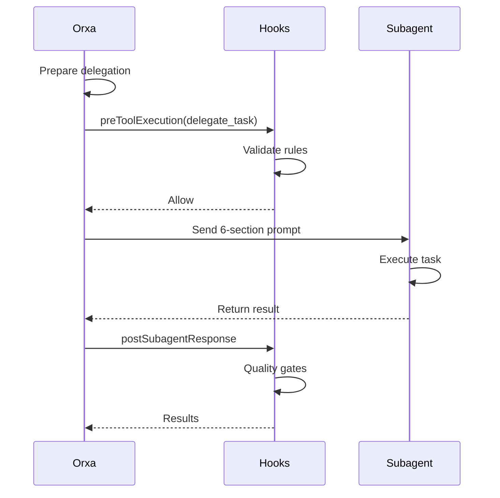

# Understanding Orchestration

Learn how Orxa decides what to delegate, to whom, and how it all fits together.

## Table of Contents

- [The Orchestration Philosophy](#the-orchestration-philosophy)
- [The Decision Flow](#the-decision-flow)
- [Task Classification](#task-classification)
- [Agent Selection Logic](#agent-selection-logic)
- [The Delegation Process](#the-delegation-process)
- [Quality Verification](#quality-verification)
- [Error Handling & Escalation](#error-handling--escalation)
- [Real-World Examples](#real-world-examples)
- [Advanced Patterns](#advanced-patterns)

---

## The Orchestration Philosophy

Orxa treats AI assistance like managing an engineering team. Just as a good Engineering Manager doesn't write all the code themselves, Orxa doesn't try to do everything — it orchestrates specialists.

### Core Principles

1. **Separation of Concerns**
   - Orxa manages, delegates, and verifies
   - Specialists execute within their domain
   - Each agent has clear responsibilities

2. **Right Tool for the Job**
   - grep/glob → Plan agent (research)
   - UI work → Frontend agent
   - Complex logic → Build agent
   - Quick fixes → Coder agent

3. **Verification at Every Step**
   - Plans are reviewed before execution
   - Code passes quality gates
   - TODOs are tracked to completion

4. **Continuous Improvement**
   - Patterns are saved to memory
   - Mistakes are learned from
   - Quality improves over time

---

## The Decision Flow

When you make a request, Orxa follows this decision tree:

```
User Request Received
        │
        ▼
┌───────────────────┐
│ 1. Classify Task  │
│    - Trivial?     │
│    - Exploratory? │
│    - Implementation?│
│    - Refactoring? │
└─────────┬─────────┘
          │
          ▼
┌───────────────────┐
│ 2. Check for Plan │
│    - Plan exists? │
│    - Plan current?│
└─────────┬─────────┘
          │
    ┌─────┴─────┐
    ▼           ▼
 Needs Plan   Has Plan
    │           │
    ▼           ▼
 Delegate    Select Agent
 to Plan     for Task
    │           │
    └─────┬─────┘
          │
          ▼
┌───────────────────┐
│ 3. Delegate Task  │
│    - 6-section    │
│      template     │
│    - Clear context│
└─────────┬─────────┘
          │
          ▼
┌───────────────────┐
│ 4. Monitor & Wait │
│    - Track progress│
│    - Handle issues │
└─────────┬─────────┘
          │
          ▼
┌───────────────────┐
│ 5. Verify Quality │
│    - Run gates    │
│    - Check output │
└─────────┬─────────┘
          │
          ▼
┌───────────────────┐
│ 6. Update State   │
│    - Mark TODOs   │
│    - Save memory  │
│    - Report back  │
└───────────────────┘
```

---

## Task Classification

Orxa classifies every request into one of four categories:

### 1. Trivial/Explicit

**Characteristics:**
- Clear, single-step task
- No ambiguity
- Well-defined scope

**Examples:**
```
"Fix the typo in the README"
"Add a console.log here"
"Change this color to blue"
```

**Handling:**
- May be handled directly or delegated to coder
- Fast turnaround
- Minimal planning needed

### 2. Exploratory

**Characteristics:**
- "How does this work?"
- "Where is X defined?"
- Learning/exploration

**Examples:**
```
"Explain the authentication flow"
"Find where user roles are checked"
"How is the database structured?"
```

**Handling:**
- Delegate to librarian or explorer
- Research before action
- May not result in code changes

### 3. Implementation

**Characteristics:**
- New feature development
- Clear requirements
- Multiple steps likely

**Examples:**
```
"Create a login page"
"Add pagination to the user list"
"Implement password reset"
```

**Handling:**
- Create/update plan
- Break into TODOs
- Delegate to appropriate specialists
- Verify each step

### 4. Refactoring

**Characteristics:**
- Changing existing code
- Improving structure
- May affect multiple files

**Examples:**
```
"Refactor the auth module to use a service pattern"
"Extract reusable components from the dashboard"
"Rename User to Account across the codebase"
```

**Handling:**
- Analyze impact first
- Delegate to architect for planning
- Use build agent for execution
- Extensive verification

---

## Agent Selection Logic

### The Selection Matrix

Orxa uses this decision matrix to select agents:

| If the task involves...               | Delegate to...      |
| ------------------------              | ----------------    |
| **Planning, research, requirements**  | `@plan`             |
| **Risk analysis, edge cases**         | `@strategist`       |
| **Plan review, validation**           | `@reviewer`         |
| **Complex multi-file implementation** | `@build`            |
| **Single-file changes, quick fixes**  | `@coder`            |
| **UI components, styling**            | `@frontend`         |
| **System design, debugging**          | `@architect`        |
| **Git operations, commits**           | `@git`              |
| **Finding code, exploration**         | `@explorer`         |
| **Documentation, research**           | `@librarian`        |
| **Web browsing, external APIs**       | `@navigator`        |
| **READMEs, articles**                 | `@writer`           |
| **Images, PDFs, diagrams**            | `@multimodal`       |
| **Mobile testing, simulators**        | `@mobile-simulator` |

### Selection Examples

**Example 1: "Create a login form"**
```
Task: Create a login form
Classification: Implementation
Agent: @frontend (UI-focused)
```

**Example 2: "Fix the API error handling"**
```
Task: Fix API error handling
Classification: Implementation
Analysis: Affects multiple files, needs careful testing
Agent: @build (complex implementation)
```

**Example 3: "Find all uses of deprecated function"**
```
Task: Find deprecated function uses
Classification: Exploratory
Agent: @explorer (codebase search)
```

**Example 4: "Is this approach secure?"**
```
Task: Security review
Classification: Exploratory/Risk analysis
Agent: @strategist (risk assessment)
```

---

## The Delegation Process

### Step 1: Task Preparation

Before delegating, Orxa prepares:

1. **TODO List** — Tracks all work items
2. **Context Gathering** — Relevant files and background
3. **Success Criteria** — How to know it's done

### Step 2: The 6-Section Template

Every delegation uses this structure:

```markdown
## Task
[Clear, specific description of what needs to be done]

## Expected Outcome
[Concrete definition of success]
- Criterion 1
- Criterion 2
- Criterion 3

## Required Tools
[List of tools the agent should use]
- read
- edit
- write
- etc.

## Must Do
[Critical requirements that cannot be skipped]
- Requirement 1
- Requirement 2

## Must Not Do
[Explicit restrictions]
- Don't do X
- Avoid Y

## Context
[Background information]
- Relevant files: src/components/...
- Related code: The Button component uses...
- Patterns to follow: Use the same approach as...
```

### Step 3: Delegation Execution



### Step 4: Result Processing

After the subagent returns:

1. **Extract work products** — Files changed, code written
2. **Run quality gates** — Lint, type check, tests
3. **Extract memory** — Patterns to remember
4. **Update TODOs** — Mark items complete
5. **Report to user** — Summary of what was done

---

## Quality Verification

### The Quality Gates

Every work product passes through:

```
┌─────────────────────────────────────────┐
│           QUALITY GATES                 │
├─────────────────────────────────────────┤
│ 1. Lint Check                          │
│    └─▶ Code style compliance           │
├─────────────────────────────────────────┤
│ 2. Type Check                          │
│    └─▶ TypeScript type safety          │
├─────────────────────────────────────────┤
│ 3. LSP Diagnostics                     │
│    └─▶ Real-time error detection       │
├─────────────────────────────────────────┤
│ 4. Test Check                          │
│    └─▶ Test suite passes               │
├─────────────────────────────────────────┤
│ 5. Build Check                         │
│    └─▶ Production build succeeds       │
├─────────────────────────────────────────┤
│ 6. Custom Validators                   │
│    └─▶ Project-specific checks         │
└─────────────────────────────────────────┘
```

### Gate Results

**All Pass:**
```
✓ Lint passes
✓ TypeScript check passes
✓ LSP diagnostics clean
✓ Tests pass
✓ Build succeeds

All quality gates passed! ✅
```

**Some Fail:**
```
✓ Lint passes
✗ TypeScript errors found
  src/components/LoginForm.tsx:15:10 - error TS2345
✓ LSP diagnostics clean
⚠ Tests skipped (no test files)
✓ Build succeeds

Quality gates partially failed. Escalating to @build for fixes...
```

---

## Error Handling & Escalation

### When Things Go Wrong

```
Subagent Fails
      │
      ▼
Check Failure Type
      │
      ├───▶ Quality Gates Failed?
      │         │
      │         ├───▶ Yes → Can fix?
      │         │           │
      │         │           ├───▶ Yes → Retry
      │         │           └───▶ No ───▶ Escalate
      │         │
      │         └───▶ No → Continue
      │
      ├───▶ Tool Error?
      │         │
      │         └───▶ Yes ───▶ Escalate
      │
      └───▶ Unclear/Complex?
                │
                └───▶ Yes ───▶ Escalate
```

### Escalation Matrix

```
coder → build → architect
explorer → librarian
frontend → build (for complex UI)
```

### Escalation Example

**Initial Delegation:**
```
Orxa → @coder: Fix the pagination bug
```

**Coder Fails:**
```
@coder: I can't find the bug. The code looks correct.
```

**Escalation:**
```
Orxa → @build: The pagination bug is more complex than expected.
@coder couldn't locate it. Please investigate thoroughly.

Context: The bug causes page 2 to show the same results as page 1.
Previous attempt: @coder reviewed src/utils/pagination.ts
```

**Build Succeeds:**
```
@build: Found it! The offset calculation was using page number
instead of page index (page - 1). Fixed and tested.
```

---

## Real-World Examples

### Example 1: Feature Implementation

**User Request:**
```
Add user authentication with login and signup
```

**Orchestration Flow:**

```
1. CLASSIFICATION
   └── Implementation (new feature)

2. PLANNING
   └── Delegate to @plan
   └── Plan creates comprehensive spec
   └── Orxa creates TODOs:
       - [ ] Design database schema
       - [ ] Create login API endpoint
       - [ ] Create signup API endpoint
       - [ ] Build login UI
       - [ ] Build signup UI
       - [ ] Add client-side validation
       - [ ] Write tests

3. EXECUTION (Parallel where possible)
   └── Delegate to @architect: Design schema
   └── Delegate to @build: Create API endpoints
   └── Delegate to @frontend: Build UI components
   └── Delegate to @build: Add validation
   └── Delegate to @build: Write tests

4. VERIFICATION
   └── Quality gates on each component
   └── Integration testing
   └── Security review by @strategist

5. COMPLETION
   └── All TODOs marked complete
   └── Memory saved: "Auth pattern: JWT tokens, bcrypt hashing"
   └── Report to user
```

### Example 2: Bug Fix

**User Request:**
```
The login button doesn't work on mobile
```

**Orchestration Flow:**

```
1. CLASSIFICATION
   └── Implementation (bug fix)

2. INVESTIGATION
   └── Delegate to @explorer: Find login button code
   └── Delegate to @mobile-simulator: Test on iOS
   └── Delegate to @mobile-simulator: Test on Android

3. ANALYSIS
   └── Issue identified: Touch event not firing
   └── Root cause: Missing touch handler

4. FIX
   └── Delegate to @frontend: Add touch handler
   └── Quality gates: Pass

5. VERIFICATION
   └── @mobile-simulator: Verify fix on both platforms
   └── All tests pass

6. COMPLETION
   └── TODO completed
   └── Memory saved: "Mobile touch events need separate handlers"
```

### Example 3: Refactoring

**User Request:**
```
Refactor the user module to use repository pattern
```

**Orchestration Flow:**

```
1. CLASSIFICATION
   └── Refactoring (architecture change)

2. ANALYSIS
   └── Delegate to @architect: Analyze current structure
   └── Delegate to @explorer: Find all user-related code
   └── Impact assessment: 15 files affected

3. PLANNING
   └── @architect designs migration strategy
   └── Orxa creates phased TODOs:
       - [ ] Create UserRepository interface
       - [ ] Implement UserRepository
       - [ ] Migrate UserService
       - [ ] Update UserController
       - [ ] Migrate tests
       - [ ] Update documentation

4. EXECUTION (Sequential due to dependencies)
   └── Phase 1: @build creates repository
   └── Phase 2: @build migrates service
   └── Phase 3: @build migrates controller
   └── Phase 4: @build migrates tests
   └── Phase 5: @writer updates docs

5. VERIFICATION
   └── All quality gates pass
   └── @reviewer validates architecture
   └── @strategist checks for risks

6. COMPLETION
   └── All TODOs complete
   └── Memory saved: "Repository pattern implementation"
```

---

## Advanced Patterns

### Pattern 1: The Validation Loop

Use `/validate` before complex work:

```
You: /validate

Orxa: ## ✅ Validation Complete

### Strategist Analysis
- Risk: Database migration needed
- Risk: API contract changes

### Reviewer Assessment
- Plan needs rollback strategy
- Missing error handling specs

You: [address issues]
You: /validate

Orxa: ## ✅ Validation Complete
All checks pass! Ready to proceed.
```

### Pattern 2: The Research Phase

For unfamiliar codebases:

```
You: Explain how the billing system works

Orxa: @librarian — Research billing system

@librarian: [comprehensive explanation]

You: Find where invoices are generated

Orxa: @explorer — Find invoice generation code

@explorer: Found in src/billing/invoice.ts

You: Now add a discount feature

Orxa: [now has context, delegates to @build]
```

### Pattern 3: The Iterative Refinement

Start small, expand scope:

```
You: Create a simple button

Orxa: @frontend creates basic button

You: Now add variants (primary, secondary, danger)

Orxa: @frontend extends button component

You: Add loading state and icons

Orxa: @frontend adds advanced features

You: Create a full design system

Orxa: [escalates to @architect for system design]
```

### Pattern 4: Orxa Mode for Parallel Work

For complex multi-part features:

```
You: orxa implement dashboard with sidebar, charts, and tables

Orxa: ## 🚀 Orxa Mode Activated

Creating 3 parallel workstreams:
- Workstream 1: Sidebar component
- Workstream 2: Chart components
- Workstream 3: Table components

[All three work in parallel via git worktrees]
[Results merged automatically]
```

---

## Summary

### Key Takeaways

1. **Orxa is the orchestrator** — It manages, delegates, and verifies
2. **Specialists do the work** — Right agent for each task
3. **Quality is enforced** — Gates at every step
4. **Context is preserved** — Memory and TODOs track everything
5. **Errors are handled** — Escalation when needed

### The Orchestration Mindset

Think of Orxa as your Engineering Manager:
- You tell it what you want to achieve
- It figures out how to get there
- It assigns work to the team
- It ensures quality standards
- It keeps you informed

You don't need to know which agent to use — that's Orxa's job. Just describe what you want, and trust the orchestration.

---

## Next Steps

- 👤 [Customize Agents](../AGENTS.md) — Learn about each specialist
- ⚙️ [Configuration](../CONFIGURATION.md) — Tune orchestration settings
- 🚀 [Orxa Mode](../ORXA-MODE.md) — Master parallel execution
- 🏗️ [Architecture](../ARCHITECTURE.md) — Deep dive into how it works
